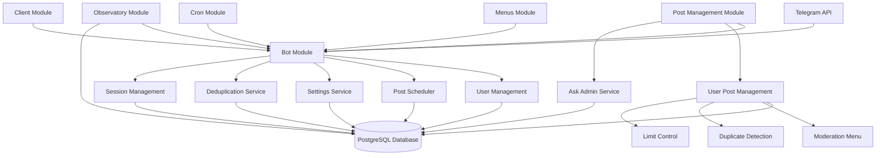
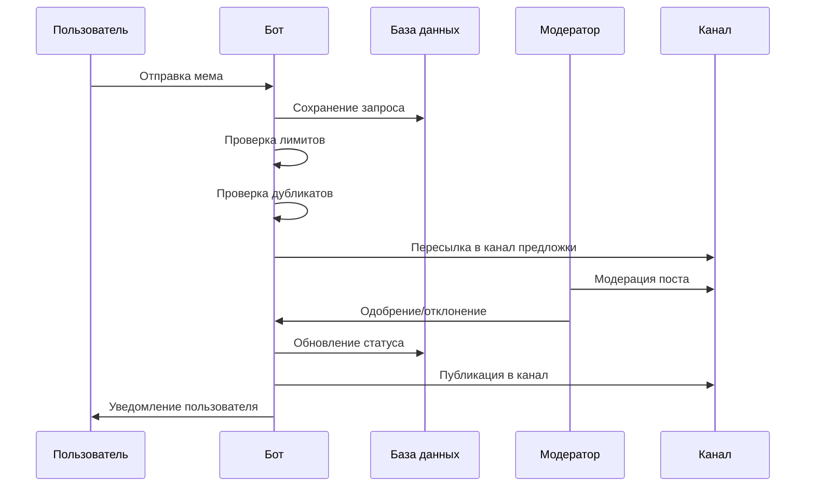

# Telegram Memes Bot

[](https://t.me/filipp_memes_bot)
[](https://t.me/filipp_memes)

Telegram бот для управления мемами и предложкой канала. Позволяет пользователям отправлять мемы на модерацию, а модераторам управлять публикацией контента.

**Реальный работающий бот**: [@filipp_memes_bot](https://t.me/filipp_memes_bot)
**Реальный канал**: [@filipp_memes](https://t.me/filipp_memes)

## 🏗️ Архитектура проекта

### Общая структура

```
apps/
└── memes-bot/
    ├── src/
    │   ├── app/
    │   │   ├── app.module.ts          # Корневой модуль приложения
    │   │   ├── app.service.ts         # Основной сервис приложения
    │   │   ├── main.ts                # Точка входа приложения
    │   │   └── modules/               # Модули приложения
    │   │       ├── bot/               # Модуль Telegram бота
    │   │       ├── config/            # Модуль конфигурации
    │   │       ├── menus/             # Модуль меню
    │   │       ├── post-management/   # Модуль управления постами
    │   │       ├── client/            # Модуль клиента
    │   │       ├── observatory/       # Модуль обсерватории
    │   │       ├── cron/              # Модуль cron задач
    │   │       └── common/            # Общие сервисы
    │   ├── environments/              # Конфигурации окружения
    │   └── assets/                    # Статические ресурсы
    ├── Dockerfile                     # Docker конфигурация
    └── project.json                   # Конфигурация проекта NX
```

### Основные модули

#### 1. Модуль бота (`bot/`)
Содержит всю логику взаимодействия с Telegram API:
- **Провайдеры**: Инициализация бота, middleware
- **Сервисы**: Управление пользователями, запросами, планировщиком, настройками
- **Сущности**: Пользователи, запросы, сессии, настройки
- **Интерфейсы**: Контекст бота

#### 2. Модуль управления постами (`post-management/`)
Отвечает за обработку пользовательских постов:
- **Сервисы**: Управление постами пользователей, обращения к админу
- **Константы**: Режимы публикации, меню модерации

#### 3. Модуль меню (`menus/`)
Управление интерфейсом бота:
- **Сервисы**: Главное меню, меню администратора, модератора

#### 4. Модуль обсерватории (`observatory/`)
Система модерации контента:
- **Сервисы**: Управление постами обсерватории
- **Сущности**: Посты обсерватории

#### 5. Модуль конфигурации (`config/`)
Управление настройками приложения:
- **Сервисы**: Базовая конфигурация
- **Конфигурации**: Переменные окружения

### Схема архитектуры



### Сущности базы данных

#### Пользователи (`UserEntity`)
- Хранение информации о пользователях
- Управление правами и ограничениями
- Статистика активности

#### Запросы пользователей (`UserRequestEntity`)
- Хранение постов на модерации
- Статусы модерации
- Связь с пользователями

#### Планировщик постов (`PostSchedulerEntity`)
- Запланированные посты
- Время публикации
- Режимы публикации

#### Хеши опубликованных постов (`PublishedPostHashesEntity`)
- Хранение хешей изображений
- Предотвращение дубликатов

#### Настройки (`SettingsEntity`)
- Конфигурация канала
- Ссылки и тексты

## 🚀 Запуск приложения

### Требования

- Node.js >= 18
- PostgreSQL >= 12
- Docker (опционально)
- Telegram Bot Token

### Переменные окружения

Создайте файл `.env` в корне проекта:

```env
# Telegram Bot
BOT_TOKEN=your_bot_token
BOT_OWNER_ID=your_telegram_id

# Channels
MANAGED_CHANNEL=your_channel_id
USER_REQUEST_CHANNEL=request_channel_id
CRINGE_CHANNEL=cringe_channel_id

# Database
DATABASE_HOST=localhost
DATABASE_PORT=5432
DATABASE_USERNAME=postgres
DATABASE_PASSWORD=postgres
DATABASE_NAME=memes_bot

# Telegram API
APP_API_ID=your_api_id
APP_API_HASH=your_api_hash

# Environment
TG_ENV=prod
```

#### Описание переменных окружения

**Telegram Bot:**
- `BOT_TOKEN` - Токен Telegram бота, полученный от BotFather
- `BOT_OWNER_ID` - Telegram ID владельца бота (администратора)

**Channels:**
- `MANAGED_CHANNEL` - ID основного канала для публикации мемов
- `USER_REQUEST_CHANNEL` - ID канала предложки для модерации постов
- `CRINGE_CHANNEL` - ID канала для публикации кринж контента

**Database:**
- `DATABASE_HOST` - Хост базы данных PostgreSQL
- `DATABASE_PORT` - Порт базы данных PostgreSQL
- `DATABASE_USERNAME` - Имя пользователя для подключения к БД
- `DATABASE_PASSWORD` - Пароль для подключения к БД
- `DATABASE_NAME` - Название базы данных

**Telegram API:**
- `APP_API_ID` - API ID приложения Telegram (https://my.telegram.org)
- `APP_API_HASH` - API Hash приложения Telegram (https://my.telegram.org)

**Environment:**
- `TG_ENV` - Окружение запуска (`prod` или `test`)

### Локальный запуск

1. Установите зависимости:
```bash
npm install
```

2. Запустите базу данных (через Docker):
```bash
docker-compose up -d
```

3. Запустите приложение:
```bash
npm run start:memes-bot
```

### Сборка и запуск в Docker

1. Сборка образа:
```bash
npm run docker:memes-bot:build
```

2. Запуск контейнера:
```bash
docker run -d --env-file .env --name memes-bot memes-bot:latest
```

### Сборка для продакшена

```bash
npm run build:memes-bot
```

## 🛠️ Основные функции

### Для пользователей

1. **Отправка мемов**: Пользователи могут отправлять изображения и видео в бота
2. **Лимиты**: Ограничение на 5 постов в сутки
3. **Обращения к админу**: Возможность отправки текстовых сообщений администратору
4. **Капча**: Защита от ботов при первом взаимодействии

### Для модераторов

1. **Модерация постов**: Интерфейс для одобрения/отклонения постов
2. **Планирование публикаций**: Различные режимы публикации (ночь, утро, день, вечер)
3. **Управление лимитами**: Возможность временного снятия ограничений с пользователей
4. **Дедупликация**: Автоматическое обнаружение дубликатов постов

### Системные функции

1. **Планировщик**: Автоматическая публикация постов в заданное время
2. **Дедупликация**: Предотвращение публикации одинаковых изображений
3. **Статистика**: Отслеживание активности пользователей
4. **Крон задачи**: Регулярные операции по обслуживанию

## 📊 Поток данных



## 🔧 Конфигурация

### Режимы публикации

- `NOW_SILENT`: Немедленная публикация
- `NEXT_INTERVAL`: Ближайший доступный слот
- `NIGHT_CRINGE`: Ночная рубрика кринжа
- `NEXT_MORNING`: Утренняя публикация
- `NEXT_MIDDAY`: Дневная публикация
- `NEXT_EVENING`: Вечерняя публикация
- `NEXT_NIGHT`: Ночная публикация

### Права пользователей

- `IS_BASE_MODERATOR`: Базовые права модератора
- `ALLOW_PUBLISH_TO_CHANNEL`: Публикация в канал
- `ALLOW_DELETE_REJECTED_POST`: Удаление отклоненных постов
- `ALLOW_RESTORE_DISCARDED_POST`: Восстановление отклоненных постов
- `ALLOW_SET_STRIKE`: Установка страйков
- `ALLOW_MAKE_BAN`: Бан пользователей

## 📈 Мониторинг и логирование

Приложение использует встроенный логгер NestJS для отслеживания:
- Ошибок обработки сообщений
- Проблем с базой данных
- Ошибок API Telegram
- Событий модерации

## 🤝 Вклад в проект

1. Форкните репозиторий
2. Создайте ветку для вашей фичи
3. Сделайте коммиты с изменениями
4. Откройте Pull Request

## 📄 Лицензия

Apache License 2.0 - смотрите файл [LICENSE](LICENSE) для подробностей.

Лицензия позволяет свободное использование, модификацию и распространение кода
с обязательным указанием авторства. При распространении производных работ
необходимо сохранять уведомления об авторстве и текст лицензии.
