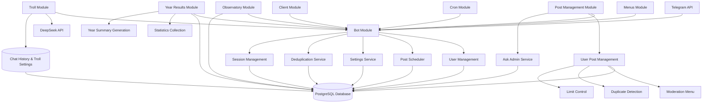
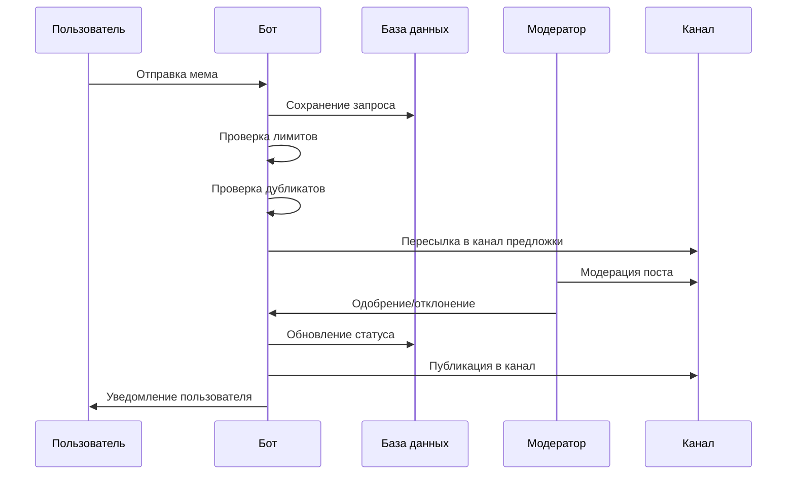

# Telegram Memes Bot

[](https://t.me/filipp_memes_bot)
[](https://t.me/filipp_memes)
[](COVERAGE.md)

Telegram бот для управления мемами и предложкой канала. Позволяет пользователям отправлять мемы на модерацию, а модераторам управлять публикацией контента.

**Реальный работающий бот**: [@filipp_memes_bot](https://t.me/filipp_memes_bot)
**Реальный канал**: [@filipp_memes](https://t.me/filipp_memes)

## 🏗️ Архитектура проекта

### Общая структура

```
apps/
└── memes-bot/
    ├── src/
    │   ├── app/
    │   │   ├── app.module.ts          # Корневой модуль приложения
    │   │   ├── app.service.ts         # Основной сервис приложения
    │   │   ├── version.ts             # Версия приложения (из env/тега)
    │   │   ├── main.ts                # Точка входа приложения
    │   │   └── modules/               # Модули приложения
    │   │       ├── bot/               # Модуль Telegram бота
    │   │       ├── config/            # Модуль конфигурации
    │   │       ├── menus/             # Модуль меню
    │   │       ├── post-management/   # Модуль управления постами
    │   │       ├── client/            # Модуль клиента
    │   │       ├── observatory/       # Модуль обсерватории
    │   │       ├── cron/              # Модуль cron задач
    │   │       ├── year-results/      # Модуль итогов года
    │   │       ├── troll/             # Тролль-бот в чатах (LLM, DeepSeek)
    │   │       └── common/            # Общие сервисы
    │   ├── environments/              # Конфигурации окружения
    │   ├── tools/troll-audit/         # Утилиты аудита промптов (в образ не попадают)
    │   └── assets/                    # Статические ресурсы
    ├── test/e2e/                      # E2E-харнес и сценарии
    ├── Dockerfile                     # Прод-образ (FROM base с зависимостями)
    └── project.json                   # Конфигурация проекта NX

Dockerfile.deps                        # Базовый образ с зависимостями (node20/node22)
Dockerfile.test / docker-compose.test.yml  # Контейнерный тестовый контур
tools/ci, tools/deploy                 # CI/CD-скрипты (base, release, deploy)
.github/workflows/ci.yml               # GitHub Actions
```

### Основные модули

#### 1. Модуль бота (`bot/`)
Содержит всю логику взаимодействия с Telegram API:
- **Провайдеры**: Инициализация бота, middleware
- **Сервисы**: Управление пользователями, запросами, планировщиком, настройками
- **Сущности**: Пользователи, запросы, сессии, настройки
- **Интерфейсы**: Контекст бота

#### 2. Модуль управления постами (`post-management/`)
Отвечает за обработку пользовательских постов:
- **Сервисы**: Управление постами пользователей, обращения к админу
- **Константы**: Режимы публикации, меню модерации

#### 3. Модуль меню (`menus/`)
Управление интерфейсом бота:
- **Сервисы**: Главное меню, меню администратора, модератора

#### 4. Модуль обсерватории (`observatory/`)
Система модерации контента:
- **Сервисы**: Управление постами обсерватории
- **Сущности**: Посты обсерватории

Парсер источников (модуль `client/`, MTProto userbot) находит медиапосты в чужих каналах и
форвардит их **напрямую в личку боту** (канал-коллектор больше не используется). Бот принимает
посты от аккаунта `PARSER_USER_ID` **без капчи и без проверки подписки**, копирует их в предложку
с подписью источника и меню модерации. Парсер отсекает рекламу по ссылкам (`AdDetector`) и
пересылает фото и видео.

#### 5. Модуль итогов года (`year-results/`)
Автоматическая генерация и публикация статистики за год:
- **Сервисы**: Сбор статистики, форматирование сообщений, публикация
- **Сущности**: Результаты года для пользователей
- **Интерфейсы**: Типы данных статистики

#### 6. Модуль конфигурации (`config/`)
Управление настройками приложения:
- **Сервисы**: Базовая конфигурация
- **Конфигурации**: Переменные окружения

#### 7. Модуль тролль-бота (`troll/`)
Отдельный «живой» бот в групповых чатах: читает переписку и язвит, шуточно
«притягивает» статьи УК РФ, кривляется, ставит реакции, умеет `/stat`, `/future`,
`/meme`, `/sumarize`.

- **Работает на LLM** (DeepSeek): генерация — `deepseek-flash`; старшая `deepseek-v4-pro`
  вызывается только для локальных проверок промптов (LLM-as-judge) и для разбора дефектов по запросу владельца;
- **Самопроверка ответа**: готовый ответ оценивает отдельный вызов-ревизор, и при низкой оценке модель переписывает его (до 3 попыток; если порог так и не взят — уходит лучший вариант). Рубрика защищает роль: отказ выполнить просьбу вне роли (код, показ промпта, «игнорируй инструкции») — это норма, а не недостаток, иначе самопроверка толкала бы бота сдавать правила;
- **Разбор дефектов**: владелец форвардит боту в личку неудачный ответ, бот находит его в истории, сохраняет в `troll_defect_entity` (ответ, реплика-источник, автор, контекст) и присылает разбор от старшей модели `deepseek-v4-pro`;
- **Помнит беседу за сутки**: всю переписку за 24 часа целиком и не режет её внутри суток; старое вычищается по крону, чтобы контекст не тонул. Различает авторов по имени и id, не продолжает старую тему после длинной паузы;
- **Смешные теги участников**: если бот — админ с правом `can_manage_tags`, раз в час он придумывает короткие (≤16 символов) теги по тому, как человек общается; впервые — от 10 сообщений (не более 2 наречений за прогон), смена — раз в сутки и от 10 новых сообщений; владелец и админы тоже нарекаются, кроме создателя чата (Telegram не даёт ему менять тег);
- **Сначала молчит**: при добавлении в чат бот пишет владельцу в личку и начинает
  работать только после подтверждения;
- **Все настройки агрессивности** (вероятности ответов, кулдауны, пороги по УК РФ)
  доступны только владельцу в админ-меню «🤖 Тролль-бот»; в чате `/menu` не работает;
- **Учёт расхода**: количество запросов, токенов и стоимость за сутки по официальному
  тарифу DeepSeek (с разбивкой по кэшу и пик/off-peak);
- **Логи**: тексты сообщений и ответов пишутся в лог (без них поведение не разобрать), у каждого
  вызова модели есть метка (`[диалог · генерация 2/3]`, `[ревизия · диалог]`, `[предсказание]`,
  `[статья-ук]`, `[стат]`, `[саммари]`, `[подкол]`), плюс полный промпт и сырой ответ модели
  на уровне `debug`. На сервере логи ротируются: суточный дамп в `/var/log/memes-bot/bot.log`,
  `logrotate` хранит текущий файл и два прошлых дня, вывод контейнера ограничен по размеру;
- **Аудит промптов**: утилиты в `apps/memes-bot/tools/troll-audit` (`npm run troll:audit`,
  `troll:audit:selfcheck`, `troll:audit:reviewer`, `troll:audit:log`) импортируют реальные
  промпты и санитайзеры модуля, прогоняют кейсы и оценивают ответы старшей моделью;
- **Защита**: изоляция пользовательского текста делимитерами, ограничение бюджета
  токенов, санитайз ввода/вывода, защита от prompt injection и перерасхода.

Подробное описание (поведение и вероятности, команды, админка, защита от инъекций,
лимиты и переменные окружения) — в [`apps/memes-bot/src/app/modules/troll/README.md`](apps/memes-bot/src/app/modules/troll/README.md).

### Схема архитектуры


```mermaid
graph TD
    A[Telegram API] --> B[Bot Module]
    B --> C[User Management]
    B --> D[Post Scheduler]
    B --> E[Settings Service]
    B --> F[Deduplication Service]
    B --> G[Session Management]
    
    H[Post Management Module] --> B
    H --> I[User Post Management]
    H --> J[Ask Admin Service]
    
    K[Menus Module] --> B
    L[Observatory Module] --> B
    M[Cron Module] --> B
    N[Client Module] --> B
    O[Year Results Module] --> B
    V[Troll Module] --> B
    V --> W[DeepSeek API]
    
    C --> P[(PostgreSQL Database)]
    D --> P
    E --> P
    F --> P
    G --> P
    I --> P
    J --> P
    L --> P
    O --> P
    
    I --> Q[Moderation Menu]
    I --> R[Duplicate Detection]
    I --> S[Limit Control]
    O --> T[Statistics Collection]
    O --> U[Year Summary Generation]
    V --> Y[(Chat History & Troll Settings)]
    Y --> P
```

### Сущности базы данных

#### Пользователи (`UserEntity`)
- Хранение информации о пользователях
- Управление правами и ограничениями
- Статистика активности

#### Запросы пользователей (`UserRequestEntity`)
- Хранение постов на модерации
- Статусы модерации
- Связь с пользователями

#### Планировщик постов (`PostSchedulerEntity`)
- Запланированные посты
- Время публикации
- Режимы публикации

#### Хеши опубликованных постов (`PublishedPostHashesEntity`)
- Хранение хешей изображений
- Предотвращение дубликатов

#### Настройки (`SettingsEntity`)
- Конфигурация канала
- Ссылки и тексты

#### Результаты года (`YearResultEntity`)
- Персональная статистика пользователей
- Данные для итогов года
- Статус публикации

#### Чаты тролль-бота (`TrollChatEntity`)
- Чаты, где работает тролль-бот, и их статус (`isActive`)
- Кто добавил бота и когда последний раз делали `/sumarize`

#### Настройки тролль-бота (`TrollSettingsEntity`)
- Синглтон (`id = 1`) со всеми вероятностями, порогами и кулдаунами
- Меняются только из админ-меню владельца

#### История переписки (`TrollMessageEntity`)
- Реплики чатов для контекста модели (текст, автор, роль, номер сообщения и `replyTo`)

#### Дефекты тролль-бота (`TrollDefectEntity`)
- Разборы неудачных ответов, которые владелец прислал боту: сам ответ, реплика-источник и её автор, контекст беседы и диагностика старшей модели
- Беседу помним 24 часа целиком, дальше старое вычищается по крону; медиа и ссылки — только пометками типа
- Номера сообщений нужны, чтобы бот видел, кто кому отвечает

#### Кэш предсказаний (`TrollPredictionEntity`)
- Предсказания `/future` на пользователя в рамках кулдауна
- Не чистится по возрасту: нужен, чтобы предсказания не повторяли темы и приёмы

## 🚀 Запуск приложения

### Требования

- Node.js >= 18
- PostgreSQL >= 12
- Docker (опционально)
- Telegram Bot Token

### Переменные окружения

Создайте файл `.env` в корне проекта:

```env
# Telegram Bot
BOT_TOKEN=your_bot_token
BOT_OWNER_ID=your_telegram_id

# Channels
MANAGED_CHANNEL=your_channel_id
USER_REQUEST_CHANNEL=request_channel_id
CRINGE_CHANNEL=cringe_channel_id

# Парсер источников (userbot). Его посты в личке бот принимает без капчи
# и кладёт в предложку. Не задан — приём от парсера выключен.
PARSER_USER_ID=your_parser_user_id

# Мастер-выключатель параллельного парсера (Source Registry → отбор → сетка
# «Парсер» в предложке). По умолчанию включён; false — полностью выключить.
# PARSER_ENABLED=true

# Database
DATABASE_HOST=localhost
DATABASE_PORT=5432
DATABASE_USERNAME=postgres
DATABASE_PASSWORD=postgres
DATABASE_NAME=memes_bot

# Telegram API
APP_API_ID=your_api_id
APP_API_HASH=your_api_hash

# DeepSeek (тролль-бот в чатах)
DEEPSEEK_API_KEY=your_deepseek_key
DEEPSEEK_BASE_URL=https://api.deepseek.com
DEEPSEEK_MODEL=deepseek-flash
DEEPSEEK_REASONING_EFFORT=none

# Environment
TG_ENV=prod
```

#### Описание переменных окружения

**Telegram Bot:**
- `BOT_TOKEN` - Токен Telegram бота, полученный от BotFather
- `BOT_OWNER_ID` - Telegram ID владельца бота (администратора)

**Channels:**
- `MANAGED_CHANNEL` - ID основного канала для публикации мемов
- `USER_REQUEST_CHANNEL` - ID канала предложки для модерации постов
- `CRINGE_CHANNEL` - ID канала для публикации кринж контента
- `PARSER_USER_ID` - ID аккаунта-парсера (userbot). Посты, которые парсер форвардит боту в
  личку, принимаются **без капчи и без проверки подписки** и уходят в предложку с подписью
  источника. Если не задан — приём от парсера выключен

**Database:**
- `DATABASE_HOST` - Хост базы данных PostgreSQL
- `DATABASE_PORT` - Порт базы данных PostgreSQL
- `DATABASE_USERNAME` - Имя пользователя для подключения к БД
- `DATABASE_PASSWORD` - Пароль для подключения к БД
- `DATABASE_NAME` - Название базы данных

**Telegram API:**
- `APP_API_ID` - API ID приложения Telegram (https://my.telegram.org)
- `APP_API_HASH` - API Hash приложения Telegram (https://my.telegram.org)

**DeepSeek (тролль-бот в чатах):**
- `DEEPSEEK_API_KEY` - ключ DeepSeek; без него тролль-бот отвечает пустым ответом, остальное работает
- `DEEPSEEK_BASE_URL` - адрес API (по умолчанию `https://api.deepseek.com`)
- `DEEPSEEK_MODEL` - рабочая модель генерации, по умолчанию `deepseek-flash`
- `DEEPSEEK_REASONING_EFFORT` - режим «размышлений» модели (`none` | `minimal` | `low` | `medium` | `high`).
  По умолчанию `none`: `deepseek-flash` — reasoning-модель, и на коротких бюджетах (24–80 токенов)
  размышления съедают весь ответ целиком, из-за чего приходили пустые сообщения

Остальные переменные тролль-бота, тарифы и лимиты — в
[`apps/memes-bot/src/app/modules/troll/README.md`](apps/memes-bot/src/app/modules/troll/README.md).

**Environment:**
- `TG_ENV` - Окружение запуска (`prod` или `test`)

### Локальный запуск

1. Установите зависимости:
```bash
npm install
```

2. Запустите базу данных (через Docker):
```bash
docker-compose up -d
```

3. Запустите приложение:
```bash
npm run start:memes-bot
```

### Сборка и запуск в Docker

1. Сборка образа:
```bash
npm run docker:memes-bot:build
```

2. Запуск контейнера:
```bash
docker run -d --env-file .env --name memes-bot memes-bot:latest
```

### Сборка для продакшена

```bash
npm run build:memes-bot
```

## 🛠️ Основные функции

### Для пользователей

1. **Отправка мемов**: Пользователи могут отправлять изображения и видео в бота
2. **Лимиты**: Ограничение на 5 постов в сутки
3. **Обращения к админу**: Возможность отправки текстовых сообщений администратору
4. **Капча**: Защита от ботов при первом взаимодействии

### Для модераторов

1. **Модерация постов**: Интерфейс для одобрения/отклонения постов
2. **Планирование публикаций**: Различные режимы публикации (ночь, утро, день, вечер)
3. **Управление лимитами**: Возможность временного снятия ограничений с пользователей
4. **Дедупликация**: Автоматическое обнаружение дубликатов постов

### Системные функции

1. **Планировщик**: Автоматическая публикация постов в заданное время
2. **Дедупликация**: Предотвращение публикации одинаковых изображений
3. **Статистика**: Отслеживание активности пользователей
4. **Крон задачи**: Регулярные операции по обслуживанию
5. **Алерт о пустеющей очереди**: владельцу в личку приходит уведомление, когда очередь публикации заполнена меньше чем на ~3 дня, на ~1 день или пуста (только днём 09:00–23:00 МСК, не чаще раза в сутки на уровень)
6. **Итоги года**: Автоматическая генерация и публикация статистики за год

### Для участников чатов (тролль-бот)

1. **Диалог**: бот читает переписку, отвечает на обращения и держит нить беседы за сутки
2. **Язвительность**: случайные подколы, кривляние слов, реакции 🤡/💩
3. **Шуточная проверка по УК РФ**: «притягивает» статьи с вероятностью и пояснением
4. **Команды**: `/stat` (срок лично тебе), `/future` (предсказание), `/meme` (репост мема), `/sumarize` (о чём говорили за сутки) — ответы публичны, их видят все
5. **Теги по интересам**: смешные теги участникам по ключевым темам их сообщений (там, где бот-админ с правом управления тегами)

Подробности и все вероятности — в [README тролль-модуля](apps/memes-bot/src/app/modules/troll/README.md).

### Итоги года

Модуль автоматически генерирует и публикует статистику за год:

#### Общая статистика (публикуется в канал):
- Всего опубликованных постов
- Количество авторов
- Активные дни
- Самый продуктивный день
- Самый активный/спокойный месяц
- Популярное время публикации
- Статистика по дубликатам
- Обезличенные данные о лидерах

#### Персональная статистика (отправляется пользователям):
- Количество предложенных и опубликованных постов
- Процент одобрения
- Активные дни и серии
- Среднее время до публикации
- Самое активное время суток
- Статистика по дубликатам

#### Команды администратора:
- `/year_result` - Генерация и предпросмотр итогов года
- `/year_result_publish` - Публикация итогов в канал и отправка пользователям

#### Автоматическая генерация:
- Каждое 25 декабря в 10:00 автоматически генерируются итоги года
- Preview отправляется владельцу бота для проверки
- Публикация выполняется вручную командой `/year_result_publish`

#### Особенности:
- Статистика собирается за календарный год
- Персональные итоги отправляются только пользователям с опубликованными постами
- Задержки между отправками для избежания rate limits
- Автоматическая обработка заблокированных пользователей
- Механизм повторных попыток при временных ошибках

## 🧭 Парсер источников (по требованию)

Модуль `parser/` — второй контур сбора контента, работает параллельно с
обсерваторией. Посты попадают в предложку отдельной сеткой «🧭 Парсер».

**Главное отличие от старой модели: предложка не наполняется потоком.** Посты
выдаются пачкой по запросу:

- кнопка **«🍲 Ещё 20»** на последней карточке в предложке, или
- канал-пост в канале предложки: **`/more`**, а также `ещё`, `еще`, `больше`,
  `насыпь` (только в канале модерации).

За раз — до 20 постов, **свежие первыми**, **не больше 3 с одного канала**
(разнообразие). Исключение — **форс-посты**: если один и тот же пост встретился
в 3+ каналах за 48 ч, он уходит сразу, без скоринга, с пометкой «⚡️ форс».

Динамика интереса берётся из модерации: взял пост (Сейчас/Очередь/Ночь) — канал
поднимается и предлагается чаще; отклонил — жёсткий игнор; истёк в бэклоге —
мягкий. Положительный рейтинг **остывает**: буст тает вдвое за 21 день без
взятий, а через 45 дней история взятий делится пополам.

Прочее: дедуп предложки (старая необработанная карточка удаляется, остаётся
нижняя, подпись «первый источник · +N»; видео — по обложке), чёрный список
источников с подтверждением, авто-discovery без ручных карточек, сбор нового
источника не глубже 48 ч, старение бэклога (карточки 7 дней, пул 14 дней),
тумблер «Старый парсер» (гасит приём постов обсерваторией, не трогая юзербот).

Полное описание архитектуры, сущностей, символов и констант — в
[`apps/memes-bot/src/app/modules/parser/README.md`](apps/memes-bot/src/app/modules/parser/README.md),
легенда для пользователя — в TGB-DOC-7.

### Меню «🧭 Парсер» (админ-меню, только владелец)

Конвейер вкл/выкл, **👴 Старый парсер**, ERR min, «Финал через N ч», AI-тумблер,
импорт подписок, пагинированные списки **🏆 Популярные / 🚫 Исключённые /
📚 Все источники**, сброс.

### Кнопки карточки «Парсер»

`▶️ Сейчас` (публикация с ссылкой на источник), `📋 В очередь`
(`NEXT_INTERVAL`, считается опубликованным), `🌙 В ночь (кринж)`
(`NIGHT_CRINGE` + перенос в кринж-канал после 6:00), `🗑 Отклонить`,
`🚫 Исключить источник` (с подтверждением → вечный чёрный список).
После постановки в сетку кнопка с датой — снятие с публикации (с подтверждением).

Админ-меню «📅 Сетка публикаций» — пагинированный список неопубликованных
постов (ближайшие первыми) со ссылками и снятием; списки источников — со
ссылками на каналы и исключением/возвратом.

## 📊 Поток данных


```mermaid
sequenceDiagram
    participant U as Пользователь
    participant B as Бот
    participant DB as База данных
    participant M as Модератор
    participant C as Канал
    
    U->>B: Отправка мема
    B->>DB: Сохранение запроса
    B->>B: Проверка лимитов
    B->>B: Проверка дубликатов
    B->>C: Пересылка в канал предложки
    
    M->>C: Модерация поста
    M->>B: Одобрение/отклонение
    B->>DB: Обновление статуса
    B->>C: Публикация в канал
    B->>U: Уведомление пользователя
```

## 🔧 Конфигурация

### Режимы публикации

- `NOW_SILENT`: Немедленная публикация
- `NEXT_INTERVAL`: Ближайший доступный слот
- `NIGHT_CRINGE`: Ночная рубрика кринжа
- `NEXT_MORNING`: Утренняя публикация
- `NEXT_MIDDAY`: Дневная публикация
- `NEXT_EVENING`: Вечерняя публикация
- `NEXT_NIGHT`: Ночная публикация

### Права пользователей

- `IS_BASE_MODERATOR`: Базовые права модератора
- `ALLOW_PUBLISH_TO_CHANNEL`: Публикация в канал
- `ALLOW_DELETE_REJECTED_POST`: Удаление отклоненных постов
- `ALLOW_RESTORE_DISCARDED_POST`: Восстановление отклоненных постов
- `ALLOW_SET_STRIKE`: Установка страйков
- `ALLOW_MAKE_BAN`: Бан пользователей

## 📈 Мониторинг и логирование

Приложение использует встроенный логгер NestJS для отслеживания:
- Ошибок обработки сообщений
- Проблем с базой данных
- Ошибок API Telegram
- Событий модерации
- Расхода DeepSeek: каждая строка лога содержит время ответа, число токенов и **стоимость за сутки**

Тролль-бот дополнительно пишет **тексты входящих сообщений и своих ответов**, а также расшифровку запроса и сырой ответ модели (уровень `debug`) — чтобы можно было детально разобрать его поведение.

Логи ротируются: раз в сутки последние 24 часа складываются в `/var/log/memes-bot/bot.log`, `logrotate` хранит **текущий файл и два прошлых дня**, а вывод контейнера ограничен по размеру (`max-size=30m`, `max-file=10`). Подробности — в [README тролль-модуля](apps/memes-bot/src/app/modules/troll/README.md#10-логи-и-их-хранение).

## 🧪 Тестирование

Проект покрыт юнит-тестами (порог покрытия **95%**, отчёт в [`COVERAGE.md`](COVERAGE.md)) и e2e-тестами на реальном приложении.

### Юнит-тесты

```bash
npm run test:memes-bot     # nx test
npm run coverage           # тесты + покрытие (порог 95%)
npm run coverage:report    # COVERAGE.md + coverage-badge.svg
```

### E2E

E2E поднимает **реальное Nest-приложение и реальный grammY Bot**, но без сети: Bot API мокается каноничным трансформером `bot.api.config.use` (в node-сборке grammY ходит через `node-fetch`), внешние границы (axios, MTProto `telegram`, DeepSeek) замоканы, а состояние — реальный Postgres. Входящие апдейты прогоняются через `bot.handleUpdate`.

Покрыто: онбординг/капча/меню, post-management (предложка, лимиты, дубли, модерация, публикация), observatory (в т.ч. user-moderation), MTProto-клиент (наблюдение канала, auth, ad-detection, альбомы, daily best), тролль (`/stat` `/future` `/meme` `/sumarize`, owner-онбординг, дефекты, реакции), cron и итоги года.

```bash
npm run e2e:docker   # docker compose: Postgres + приложение + прогон e2e
```

Весь тестовый контур контейнеризован: `Dockerfile.test` + `docker-compose.test.yml` (Postgres c `pg_trgm`).

## 🔁 CI/CD и версионирование

CI/CD — GitHub Actions на **self-hosted раннере в Docker** (на этой машине, рядом с остальными контейнерами).

- **PR**: `lint` → юнит-тесты с покрытием (порог 95%) → сборка прод-образа → **e2e**.
- **push в `main`**: то же плюс **semantic-release** (версия из conventional commits, git-тег) и **деплой**; при неудачном старте контейнера — автоматический откат на предыдущий образ.
- **Деплой по тегам**: версия вычисляется автоматически (`feat` → minor, `fix`/`perf` → patch), тег `vX.Y.Z`; версия прокидывается в контейнер как `APP_VERSION` и попадает в уведомление владельцу при старте.
- **Скорость**: базовые образы зависимостей `telegram-bot-deps:node20` / `:node22` (тег = хэш `package-lock.json`) собираются отдельным job'ом только при изменении пакетов; приложение и тесты собираются `FROM` них. Прод-образ собирается один раз в test-job (тег `sha-<commit>`) и переиспользуется деплоем. `nx`-кэш — через BuildKit.
- **Секреты**: не хранятся в репозитории — SSH/registry-доступы лежат на хосте раннера и монтируются read-only в `/deploy-secrets`.

### Self-hosted раннер

Раннер запущен в Docker на этой машине (`memes-bot-runner`) рядом с остальными контейнерами:

```
docker run -d --name memes-bot-runner --restart unless-stopped --cpus=2 --memory=4g \
  -e REPO_URL=https://github.com/semirov/tg-bot \
  -e ACCESS_TOKEN=<PAT/OAuth с доступом к репозиторию> \
  -e RUNNER_NAME=memes-bot-runner -e LABELS=memes-bot -e RUNNER_SCOPE=repo \
  -e DISABLE_AUTOMATIC_DEREGISTRATION=true \
  -e CONFIGURED_ACTIONS_RUNNER_FILES_DIR=/runner-config \
  -e DISABLE_AUTO_UPDATE=true -e RUN_AS_ROOT=true \
  -v /var/run/docker.sock:/var/run/docker.sock \
  -v /home/filipp/.deploy-secrets:/deploy-secrets:ro \
  -v memes-runner-config2:/runner-config -v memes-runner-work:/_work \
  myoung34/github-runner:latest
```

Ключевое: `CONFIGURED_ACTIONS_RUNNER_FILES_DIR` + `DISABLE_AUTOMATIC_DEREGISTRATION=true` дают
переиспользование регистрации (раннер не дерегистрируется и не падает после каждой job), а
`ACCESS_TOKEN` позволяет перерегистрироваться, если конфиг потерян. **Не задавайте `EPHEMERAL`** —
в образе это флаг: любое непустое значение (включая `false`) включает режим «одна job на контейнер».

Скрипты: `tools/ci/build-base.sh`, `tools/ci/release.sh`, `tools/deploy/deploy.sh`.

## 🤝 Вклад в проект

1. Форкните репозиторий
2. Создайте ветку для вашей фичи
3. Сделайте коммиты с изменениями
4. Откройте Pull Request

## 📄 Лицензия

Apache License 2.0 - смотрите файл [LICENSE](LICENSE) для подробностей.

Лицензия позволяет свободное использование, модификацию и распространение кода
с обязательным указанием авторства. При распространении производных работ
необходимо сохранять уведомления об авторстве и текст лицензии.
